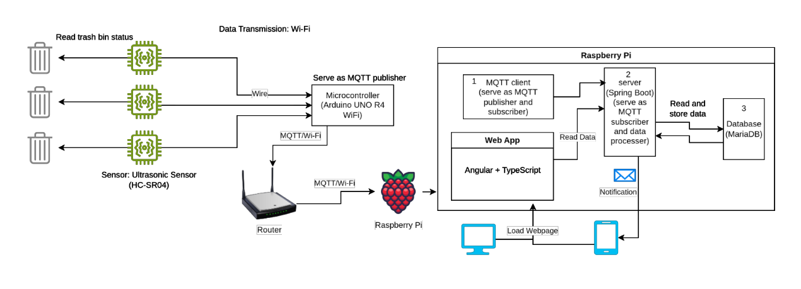

# Smart Waste Management System

## Project Overview

Smart Waste Management System is a full-stack IoT application designed to monitor and manage waste bins across campus using ultrasonic sensors. The system provides real-time monitoring, automated alerts, and an intuitive web interface for efficient waste management.

This project was developed as a **Capstone project at Sheridan College (2025)** as a collaborative team effort.

### Project Video

Watch the full project demonstration: [YouTube Video](https://www.youtube.com/watch?v=5-iySpclYTk)

**🏆 Achievement**: Recognized as one of the top projects, ranked **10th out of 49** projects in the Capstone showcase for excellence in full-stack development, IoT integration, and real-world problem solving.

## System Architecture Diagram



---


## Technology Stack

### Frontend
- **Angular 19**: Modern TypeScript framework with standalone components
- **Angular Google Maps**: Google Maps integration for location visualization
- **Bootstrap 5**: Responsive UI components

### Backend
- **Spring Boot 3**: Java-based RESTful API
- **Spring Security**: JWT-based authentication and authorization
- **Spring Data JPA**: Database abstraction layer
- **Spring Mail**: Email service integration
- **Hibernate**: ORM for database operations
- **MySQL**: Relational database

### Infrastructure
- **MQTT**: Real-time sensor data communication
- **Arduino/Raspberry Pi**: IoT hardware with ultrasonic sensors
- **Ultrasonic Sensors**: Distance measurement sensors for fill level detection

## My Contributions

As part of the development team, I was primarily responsible for three key areas:

### 1. 📧 Email Notification System

Designed and implemented an automated email notification system that alerts cleaners when trash bins exceed their fill threshold.

**Key Features:**
- Automated email alerts using Spring Mail
- Location address included in email content
- Configurable alert intervals to prevent spam (default: 1 hour between alerts)
- Personalized email content with cleaner name and bin details

**Implementation Highlights:**
- Integrated with Spring Mail for email delivery
- Implemented alert interval logic to track `lastAlertTime` and prevent duplicate notifications
- Error handling for failed email deliveries

**Email Example:**
```
Hi Mike,

Trash bin "Trashbin 2" is 93.5% full and requires attention.

Location: 1430 Trafalgar Rd

Thanks,
Smart Waste Management System
```

**Code Snippet:**
```java
@Override
public void sendThresholdAlertToCleaners(TrashBin bin, float fillLevel) {
    for (Cleaner cleaner : bin.getCleaners()) {
        if (cleaner.getEmail() != null) {
            SimpleMailMessage message = new SimpleMailMessage();
            message.setTo(cleaner.getEmail());
            message.setSubject("Alert: " + bin.getName() + " - " + String.format("%.1f", fillLevel) + "% Full");
            
            String emailBody = String.format(
                "Hi %s,\n\n" +
                "Trash bin \"%s\" is %.1f%% full and requires attention.\n\n" +
                "Location: %s\n\n" +
                "Thanks,\n" +
                "Smart Waste Management System",
                cleaner.getName(),
                bin.getName(),
                fillLevel,
                bin.getLocation() != null ? bin.getLocation().getAddress() : "Location not available"
            );
            
            message.setText(emailBody);
            mailSender.send(message);
        }
    }
}
```

**Full Code**: See `code/MailServiceImpl.java`

---

### 2. 🌍 Google Maps Integration

Implemented comprehensive Google Maps functionality for visualizing and managing trash bin locations across the campus.

**Key Features:**
- Interactive map visualization with Angular Google Maps
- Click-to-select location for new trash bins
- Automatic address retrieval using reverse geocoding
- Auto-centering and zoom functionality for existing trash bins
- Manual address editing to correct Geocoding API inaccuracies
- Color-coded markers based on fill level status

**Implementation Highlights:**
- Integrated Angular Google Maps (`@angular/google-maps`) for frontend map rendering
- Implemented reverse geocoding to convert coordinates to addresses
- Created auto-centering logic that centers and zooms map when editing existing trash bins
- Added manual address editing feature to handle Geocoding API inaccuracies (e.g., "G Wing" vs "E Wing")
- Synchronized map markers with table data using filtered trash bins

**Frontend Code Snippet:**
```typescript
// Auto-center map to trash bin location on Edit page
ngOnInit(): void {
  this.binId = Number(this.route.snapshot.paramMap.get('id'));
  this.trashbinsService.getBinByBinId(this.binId).subscribe({
    next: (data) => {
      this.trashbin = data;
      // Auto-center map to trashbin location
      if (this.trashbin.location?.latitude && this.trashbin.location?.longitude) {
        this.center = {
          lat: this.trashbin.location.latitude,
          lng: this.trashbin.location.longitude
        };
        this.markerPosition = {
          lat: this.trashbin.location.latitude,
          lng: this.trashbin.location.longitude
        };
      }
    }
  });
}
```

**Full Code**: 
- Frontend: `code/trashbins-list.component.ts`, `code/trashbins-add.component.ts`
---

### 3. 🧮 Trash Bin Fill Percentage Calculation 

Developed the trash bin fill percentage calculation algorithm that to determine trash bin fill levels.

**Key Features:**
- **Fill Percentage Calculation**: Core algorithm that calculates trash bin fill percentage from ultrasonic sensor distance readings
- Accurate fill percentage calculation based on bin height and sensor distance
- Error handling for edge cases (invalid height, distance exceeding height)
- Integration with alert system to trigger email notifications at threshold

**Implementation Highlights:**
- **Formula**: `(height - distanceReading) / height * 100`
- Validates bin height before calculation (prevents division by zero)
- Handles edge case where distance reading exceeds bin height
- Clamps result to valid percentage range (0-100%)
- Integrated with `trashBinFillAndAlert()` method to update database and trigger email alerts
- Tracks `lastAlertTime` to prevent alert spam

**Code Snippet:**
```java
/**
 * Calculate fill percentage based on bin height and distance reading
 * Formula: (height - distance) / height * 100
 */
private float calculateFillPercentage(float height, float distanceReading) {
    // Validate bin height
    if (height <= 0.0F) {
        System.out.println("Invalid bin height: " + height);
        return 0.0F;
    }

    // Prevent distance reading from exceeding bin height
    if (distanceReading > height) {
        System.out.println("Distance reading (" + distanceReading + "cm) exceeds bin height (" + height
                + "cm). Setting to height.");
        distanceReading = height;
    }

    float fillPercentage = (height - distanceReading) / height * PERCENTAGE_MULTIPLIER;

    // Ensure percentage is within valid range (0-100%)
    return Math.max(0.0F, Math.min(100.0F, fillPercentage));
}

@Override
public void trashBinFillAndAlert(Sensor sensor, float distanceReading) {
    TrashBin bin = trashBinRepository.findBySensor(sensor);
    if (bin == null) {
        System.out.println("No bin found for sensor ID: " + sensor.getId());
        return;
    }

    float fill = calculateFillPercentage(bin.getHeight(), distanceReading);
    
    // Update current fill percentage
    bin.setCurrentFillPercentage(fill);

    // Trigger alert if threshold exceeded
    if (fill >= bin.getThreshold()) {
        LocalDateTime now = LocalDateTime.now();
        
        // Check alert interval to prevent spam
        if (bin.getLastAlertTime() == null ||
             bin.getLastAlertTime().isBefore(now.minusHours(ALERT_INTERVAL_HOURS))) {
            mailService.sendThresholdAlertToCleaners(bin, fill);
            bin.setLastAlertTime(now);
        }
        trashBinRepository.save(bin);
    } else {
        // Fill level is normal, reset alert time
        if (bin.getLastAlertTime() != null) {
            bin.setLastAlertTime(null);
        }
        trashBinRepository.save(bin);
    }
}
```

**Full Code**: See `code/TrashBinServiceImpl.java` (relevant methods)

---

**Note**: This is a portfolio excerpt focusing on my contributions. The full project is private as it is a Capstone project developed by a team. Selected code snippets and demo are used to demonstrate my work while respecting project confidentiality.
---

## Demo


